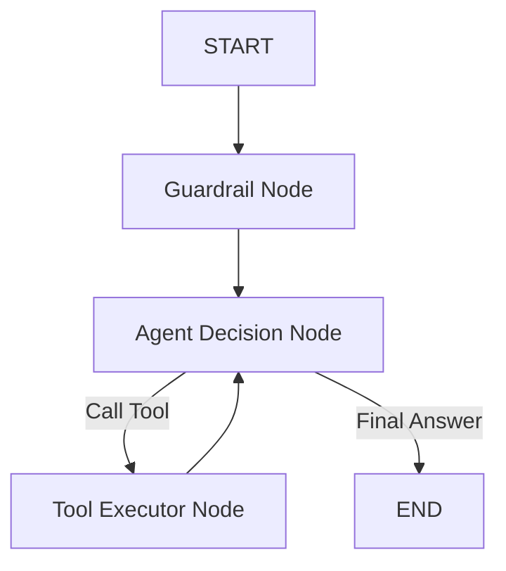

# AGENTS.md - CARE AI Agent Architecture

This document describes the structure, nodes, and tools utilized by the CARE (Clinical Assistance & Resource Engine) AI Agent.

## 🧠 Architecture Overview
CARE is built using **LangGraph** (atomic node pattern) to choreograph decision-making, guardrails, multi-turn reasoning, and tool calls.

### 1. Nodes
- **`guardrail_node`**: Analyzes the latest user message to verify clinical/safety boundaries and determines whether to allow RAG (`allow_rag` state flag).
- **`agent_node`**: Binds available tools dynamically based on the state. Uses Gemini LLM to decide whether to respond directly or invoke a tool.
- **`tools` (ToolExecutor)**: Executes the selected tool asynchronously and passes the output back to `agent_node`.

### 2. Available Tools
- **`get_rag_answer(query: str)`**: Fetches clinical articles and medical context from MongoDB Atlas vector index, synthesizes an evidence-based answer, and appends the exact source URLs.
- **`request_location_quick_reply()`**: Triggered when a user asks for nearby medical clinics/hospitals but coordinates are missing. Initiates a LINE Quick Reply requesting location coordinates.
- **`find_nearby_hospitals(lat: float, lng: float)`**: Triggered when GPS coordinates are sent by the user. Performs a geospatial MongoDB query and returns the 5 closest facilities formatted with Google Maps links.

## 🛡️ Coding Disciplines
- **No Markdown in LINE replies**: Always use plain text and clean line breaks. Never output `**bold**`, `# headers`, or Markdown link syntax `[text](url)` to LINE bot.
- **RAG Prefix**: When `get_rag_answer` is invoked, the final reply must start with `"以下為 RAG 回應："`.
- **References**: Always preserve the exact references appended by the RAG service at the bottom of the reply.
